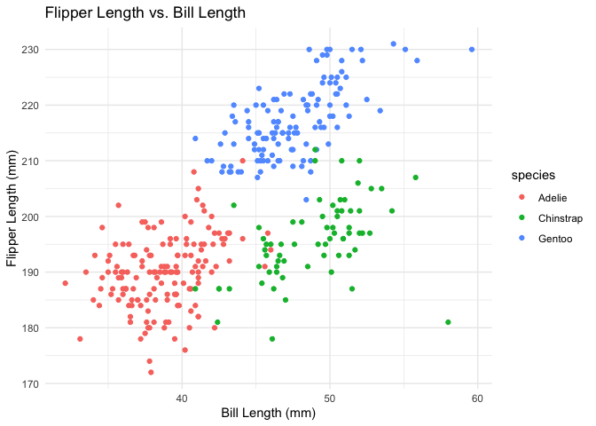

P8105 HW 1
================
AJ Catalano
29 October 2021

# Problem 1

Creating a data frame comprised of:

-   a random sample of size 10 from a standard Normal distribution
-   a logical vector indicating whether elements of the sample are
    greater than 0
-   a character vector of length 10
-   a factor vector of length 10, with 3 different factor “levels”

<!-- -->

    ## ── Attaching packages ─────────────────────────────────────── tidyverse 1.3.1 ──

    ## ✓ ggplot2 3.3.5     ✓ purrr   0.3.4
    ## ✓ tibble  3.1.5     ✓ dplyr   1.0.7
    ## ✓ tidyr   1.1.4     ✓ stringr 1.4.0
    ## ✓ readr   2.0.2     ✓ forcats 0.5.1

    ## ── Conflicts ────────────────────────────────────────── tidyverse_conflicts() ──
    ## x dplyr::filter() masks stats::filter()
    ## x dplyr::lag()    masks stats::lag()

``` r
# creating the data frame from above using tibble
df_1 = tibble(
  num_vec = rnorm(10),
  logic_vec = num_vec > 0,
  char_vec = c("Techno", "is", "superior", "to", "all", "other",
                "forms", "of", "electronic", "music"),
  factor_vec = factor(c("Acid", "Dub", "Dub", "Minimal", "Acid",
                         "Acid", "Minimal", "Dub", "Acid", "Minimal"))
)

# displaying df_1
df_1
```

    ## # A tibble: 10 × 4
    ##    num_vec logic_vec char_vec   factor_vec
    ##      <dbl> <lgl>     <chr>      <fct>     
    ##  1 -0.0642 FALSE     Techno     Acid      
    ##  2  0.302  TRUE      is         Dub       
    ##  3 -0.446  FALSE     superior   Dub       
    ##  4  0.107  TRUE      to         Minimal   
    ##  5  0.0378 TRUE      all        Acid      
    ##  6 -0.209  FALSE     other      Acid      
    ##  7 -0.236  FALSE     forms      Minimal   
    ##  8  0.0877 TRUE      of         Dub       
    ##  9  0.284  TRUE      electronic Acid      
    ## 10  0.630  TRUE      music      Minimal

df_1 is cool. If you cannot tell, I enjoy techno, which happens to be
one of New York’s only redeeming offerings.

``` r
mean(num_vec, logic_vec, char_vec, factor_vec)
```

When I try to take the mean of each variable using the above code, I am
told that the first variable, num_vec, does not exist/is not found. I
will try using the **pull** function.

``` r
# using the pull function to extract variables from df_1 and find their means
mean(df_1 %>% pull(num_vec))
## [1] 0.04938758
mean(df_1 %>% pull(logic_vec))
## [1] 0.6
mean(df_1 %>% pull(char_vec))
## Warning in mean.default(df_1 %>% pull(char_vec)): argument is not numeric or
## logical: returning NA
## [1] NA
mean(df_1 %>% pull (factor_vec))
## Warning in mean.default(df_1 %>% pull(factor_vec)): argument is not numeric or
## logical: returning NA
## [1] NA
```

Using the above code, R returned numeric values for num_vec (0.0493876)
and logic_vec (0.6), but returned NA for char_vec and factor_vec.

``` r
as.numeric(df_1 %>% pull(logic_vec))
as.numeric(df_1 %>% pull(char_vec))
as.numeric(df_1 %>% pull(factor_vec))
```

The **as.numeric** function returns integers for logic_vec and
factor_vec, which means that R treats these vectors as numeric. However,
the function returns NA for char_vec, showing that R does not treat
character vectors as numeric.

# Problem 2

The penguins data contains information about penguin species, location,
bill length (mm) and depth (mm), flipper length (mm), mass (g), sex, and
year documented. The dataset contains 344 observations and 8 variables.
As penguin flipper length is of perpetual concern, we should note the
mean penguin flipper length: NA.

<!-- -->
